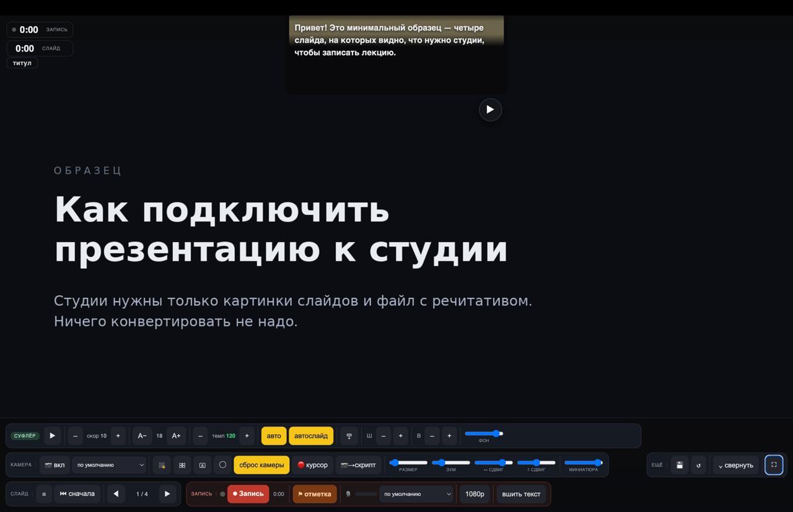

# BStudio



Локальная студия записи видео-лекций в браузере: слайды + камера в углу + телесуфлёр с речитативом + запись в видео.
Работает офлайн, без сборки и зависимостей — один HTML-файл плюс маленький лаунчер.

## Лицензия

[MIT](LICENSE) — свободно используйте, меняйте и распространяйте, при условии указания авторства (копирайта в файле
`LICENSE`).

## Файлы репозитория

| Файл                    | Зачем                                                          |
|--------------------------|-----------------------------------------------------------------|
| `studio.html`            | сама студия: слайды, камера, суфлёр, запись                     |
| `studio-launch.command`  | macOS: двойной клик — поднимает локальный сервер и открывает студию |
| `studio-launch.cmd`      | Windows: то же самое, сервер на встроенном PowerShell            |
| `example/`               | готовый учебный урок на 4 слайда — открывай студию и пробуй сразу |

## Что нужно студии

Одна вещь обязательная и одна по желанию, лежащие рядом в папке урока:

1. **Картинки слайдов** — обычные PNG в подпапке `deck_frames/`, по имени `p-01.png`, `p-02.png`, … Чем ты их сделал,
   студии всё равно — Keynote, Figma, PowerPoint, экспорт из чего угодно, лишь бы на выходе были файлы. Раскладывать
   по шаблону необязательно: сгодится **любая папка с картинками** (png, jpg, webp, avif, gif, bmp), порядок слайдов
   будет по именам файлов. Так открывается и то, что декой никогда не было, — папка скриншотов или сканов.
2. **Текстовый файл с речитативом** — `03-script.md`, где написано, что говорить на каждом слайде. **Необязателен:**
   без него урок всё равно откроется, в списке будет помечен «без речитатива», а суфлёра не будет вовсе — ни окна
   с текстом, ни его кнопок в панели и мини-пульте, ни «вшить текст». Слайды, камера, отметки и запись работают
   как обычно.

Больше ничего. Никаких конвертаций и промежуточных форматов: положил рядом — и записываешь. Подробный формат
`03-script.md` — в `example/README.md` и `example/lesson1/03-script.md`.

Студия также умеет открыть **PDF** рядом с уроком (рендерит страницы на лету через `pdf.js` с CDN — нужен интернет).
Если дека выгружена на страницу Letter или A4, слайд 16:9 лежит на ней с однотонными полями — студия находит их и
срезает, а масштабирует так, чтобы 1920 пришлось на сам слайд. Рамку ищет по всем страницам сразу и берёт объединение,
чтобы слайды не прыгали в размере; не трогает, если углы страницы разного цвета, если поля меньше пары процентов или
если от страницы осталось бы меньше пятой части. Ещё студия
**видит PPTX** в списке источников, но не умеет его отрисовать: PPTX сначала нужно превратить в PDF или в кадры любым
внешним конвертером. Путь с готовыми PNG-кадрами — единственный, что работает полностью офлайн, и самый надёжный для
записи.

## Требования (один раз)

- **Google Chrome** — камера и студия работают через него.
- **macOS:** Python 3 — `studio-launch.command` поднимает им простой локальный сервер (камера в браузере работает
  только через `http://localhost`, не через `file://`).
- **Windows:** ничего ставить не надо — `studio-launch.cmd` поднимает сервер встроенным PowerShell.

## Конвенция папок

```text
<курс>/
  <модуль>/<урок>/
      03-script.md          ← речитатив урока (имя фиксированное)
      deck_frames/          ← кадры слайдов, p-01.png … p-NN.png
```

Урок «виден» студии, если в нём есть хоть что-то рисуемое: `deck_frames/` с кадрами, PDF или папка с картинками.
Речитатив рядом — по желанию; без него суфлёр просто не показывается. Поэтому студии можно скормить **любую папку с картинками**: она откроется как урок без
текста, а если внутри несколько подпапок с картинками, каждая станет отдельным уроком в списке.

## Флоу

Двойной клик по **`studio-launch.command`** (на Windows — по **`studio-launch.cmd`**) → откроется Chrome:

1. **📁 Выбрать папку курса** — укажи корень курса (`<курс>`). Студия просканирует уроки.
2. Выбери **урок** из выпадающего списка → **▶ Поехали**.
3. **📷 вкл** — разреши камеру и микрофон (проверь, что полоска 🎙 прыгает при речи).
4. **⏺ Запись** → отсчёт 3-2-1 → листай слайды (◀ ▶ или стрелки), читай суфлёр. **⏹ Стоп** → `lecture-….webm` (+
   `*.markers.txt`, если ставил отметки) сохранятся **в папку урока**.

Студия помнит последний курс и урок — в следующий раз жми **«↩ Открыть последний курс»**.

## В студии

- **Суфлёр:** ▶/пробел — автопрокрутка, скорость –/+, шрифт A−/A+. **Темп −/+** (сл/мин, шаг 5) — основной параметр:
  задаёшь темп чтения (реальные слова/мин — считается по **фактическому числу слов слайда и высоте текста**, поэтому
  совпадает с академическими 120–150), скорость прокрутки подстраивается под каждый слайд, чтобы держать этот темп;
  зелёный = 120–150. Скорость и темп связаны (меняешь одно — меняется другое); смена ширины/кегля темп держит, а
  скорость пересчитывает. Позиция — иконка показывает, куда уедет (стрелка вверх = уйдёт вверх). Ширина **Ш −/+**,
  высота **В −/+**, прозрачность. Показать/скрыть суфлёр — клик по слову **«суфлёр»** в меню (зелёная подсветка =
  включён, серая = выключен). Подсветка читаемой строки — бежевая плашка в 3 строки (центр ярче). Тап по тексту — пауза.
  Показывает **только речитатив** (без названий слайдов).
- **Камера:** выбор устройства (включая **Continuity Camera** — айфон как вебка), 8 позиций, форма ▭/◯,
  размер/зум/сдвиг, «на весь экран», зеркало, миниатюра слайда. Полный список параметров с диапазонами и **per-slide
  настройкой через `meta`** — в разделе «[Камера: параметры и meta](#камера-параметры-и-meta)» ниже. Камера-оверлей и
  таймеры в видео не пишутся — только сам кадр камеры.
- **Запись:** ⏺ → отсчёт **3-2-1** → пишет. ⏸ пауза/продолжить → ⏹ стоп. Видео **пишется сразу на диск** в папку урока (
  краш не теряет запись, RAM не пухнет; нет доступа на запись — фолбэк на скачивание .webm). Сводит слайд + камеру +
  микрофон (дропдаун выбора микрофона). Суфлёр в видео **не попадает** (надо — «вшить текст»). Размер кадра — кнопка
  `1080p` / `720p` / **по слайдам** (см. следующий пункт). Закрыть вкладку во время записи браузер не даст молча. **⚑ отметка** — метка-таймкод «тут косяк / переснимал»; паузы и
  смены слайда логируются сами → рядом с видео `*.markers.txt` для монтажа.
- **Размер кадра записи** — кнопка рядом с «вшить текст» листает три варианта: `1080p` (1920×1080), `720p`
  (1280×720) и **по слайдам** — на кнопке тогда написан реальный размер, например `1600×1200`. Первые два всегда
  16:9: слайд вписывается в кадр, остаток добирается чёрным. «По слайдам» берёт размер самой большой картинки урока,
  поэтому полей не остаётся вовсе: дека 1920×1080 даст те же 1920×1080, дека 4:3 или вертикальные скриншоты — свой
  размер. Стороны округляются до чётных (требование кодека), больше 4K не берём.
- **Свернуть панель:** «⌄ свернуть» прячет настройки и оставляет мини-пульт снизу по центру — листать слайды,
  запись/пауза/стоп, камера. «⌃» — вернуть панель.
- **💾 / ↺:** все параметры и так автосохраняются. **💾** запоминает текущую конфигурацию как «мою»; **↺** возвращает её (
  а если ни разу не сохранял — стандартные значения).
- **авто / автослайд:** «авто» — автопрокрутка суфлёра через 1с после смены слайда; «автослайд» — авто-переход на
  следующий слайд по концу речитатива: отсчёт **5..4..3..2..1** в правом нижнем углу окна суфлёра запускается ещё пока
  суфлёр доезжает, так что переключение происходит **через 2с после** конца текста (таймкод в метки). Можно домотать
  колёсиком до конца — отсчёт тоже стартует. Вместе ≈ hands-free.
- **Горячие клавиши:** ← → слайды · пробел суфлёр · ↑↓ скорость · R запись · F полный экран · ☰ назад к выбору урока.

## Камера: параметры и meta

| Параметр         | Где                  | Диапазон / значения                                                |
|------------------|----------------------|--------------------------------------------------------------------|
| Вкл/выкл         | 📷 вкл               | —                                                                  |
| Устройство       | дропдаун             | системные камеры + **Continuity Camera** (айфон)                   |
| Позиция          | кнопка-звёздочка     | 8 точек, нумерация **1–8**: 1 ↖, 2 ↑, 3 ↗, 4 →, 5 ↘, 6 ↓, 7 ↙, 8 ← |
| Форма            | ▭ / ◯                | прямоугольник 16:9 / круг                                          |
| Размер           | ползунок «размер»    | **14–42 %** ширины экрана                                          |
| Зум              | ползунок «зум»       | **1.0–2.5×** (цифровой, по центру)                                 |
| Сдвиг ↔ / ↕      | ползунки             | **−1…+1** (двигает кадр; полезно с зумом)                          |
| На весь экран    | человек-в-рамке      | вкл/выкл (камера крупно вместо слайда)                             |
| Миниатюра слайда | ползунок «миниатюра» | **0–100 %** (только в фуллскрин-камере; не в видео)                |
| Зеркало          | иконка               | вкл/выкл                                                           |

### meta-камера (своя настройка на каждый слайд)

Если слайд не адаптирован под камеру (она перекрывает контент) — задай камере параметры именно для него. Сразу после
`### Слайд X.Y` ставится **HTML-комментарий** (невидим в рендере markdown, не заголовок):

```text
### Слайд 2.3 — *…*
<!-- meta:camera type: round, position: 3, size: 25, zoom: 1.4 -->

речитатив…
```

Ключи (любой набор; чего нет — берётся из текущих/базовых настроек):

- `type: round | rect` — форма
- `position: 1–8` — позиция (см. таблицу выше)
- `size: 14–42` — размер в % ширины
- `zoom: 1.0–2.5`
- `full: on` — камера на весь экран
- `off` — скрыть камеру на этом слайде (поток не глушится, мгновенно вернётся)

Кнопки в группе «камера»:

- **«мета»** (тумблер) — *следовать*: при переходе на слайд камера авто-подстраивается под его `meta:camera`; на слайде
  **без** меты — откат к **базовым** размеру/позиции/форме (те, что стояли при включении режима). Это и есть «возврат к
  сохранённым на следующем слайде».
- **«мета» выключена** — камеру не трогает, но сверху на ~6 c показывает баннер с рекомендацией (только то, что
  **отличается** от текущего) — установишь руками, если захочешь.
- **📷→скрипт** — записывает текущие параметры камеры в `03-script.md` для текущего слайда (создаёт/обновляет
  `<!-- meta:camera … -->`). Не надо писать руками: выставил камеру → клик. *(Папка открыта на запись; подстраховка —
  git.)*

**Номер слайда:** сверху по центру — чип «слайд 2.3» (номер из скрипта, не сквозной 7/42). Только для тебя, в видео не
пишется.

## Результат

Видео на выходе — **`.webm`**. Открывать в **Chrome или VLC** (QuickTime webm не умеет — легко принять за «нет звука»).
Сырой `.webm` из студии **не перематывается** (`MediaRecorder` пишет потоком без индекса/длительности — это норма), и
некоторые плееры/мессенджеры инлайн его не играют. При необходимости перегоняется в mp4 обычным `ffmpeg`:

```sh
ffmpeg -i lecture-….webm -r 30 -c:v libx264 -crf 20 -preset slow -pix_fmt yuv420p \
  -c:a aac -b:a 192k -movflags +faststart lecture.mp4
```

`-r 30` важен: `MediaRecorder` пишет переменный фреймрейт, без принудительного FPS звук может разъехаться при монтаже.

## Заметки

- Слайды подаются готовыми кадрами (PNG), а не живым HTML — так надёжнее для захвата и не зависит от того, чем дека
  была сделана.
- Сопоставление речитатива и слайдов — по `id` из `manifest.json` рядом с кадрами, если файла нет — по порядку. В
  `03-script.md` слайды помечены `### Слайд X.Y — *…*`.
- **Титульный слайд:** помечается в `03-script.md` строкой `## Титульный слайд` (отдельной записью без текста). Без
  неё кадры сопоставляются по порядку со сдвигом на 1 (титул берёт текст первого слайда). На титуле суфлёр — заглушка.
  Таймер **записи** идёт (считает с момента старта записи, титул тоже), а таймер **слайда** на титуле заморожен — там
  читать нечего.
- Выбор папки курса — это API File System Access, работает в Chrome/Edge (в Safari нет). Папка открывается на
  **запись** (readwrite) — туда падают `lecture-*.webm` и `*.markers.txt`.
- **Размытие фона:** отдельной кнопки нет — делается нативно в macOS на **Continuity Camera**: Пункт управления →
  Видеоэффекты → «Портрет». Качество лучше JS-сегментации, применяется до браузера.
- **Метки (`*.markers.txt`):** таймкоды — позиции в *смонтированном* видео (паузы уже вырезаны, т.к. на паузе запись
  стоит). `ОТМЕТКА` — где жал ⚑; `пауза/склейка` — где ставил на паузу; `смена слайда` — границы слайдов.
